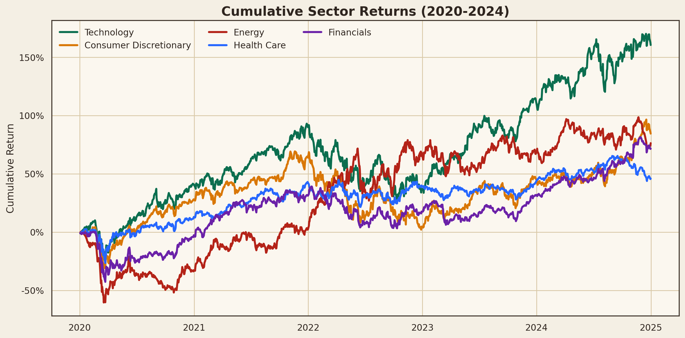
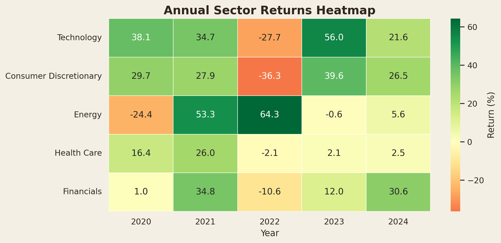
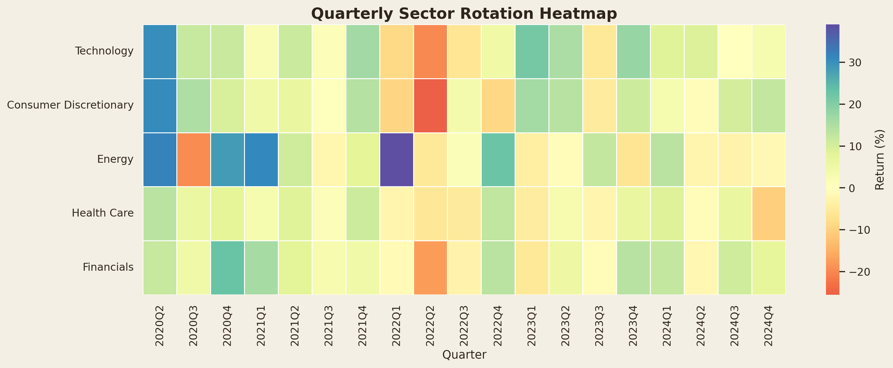
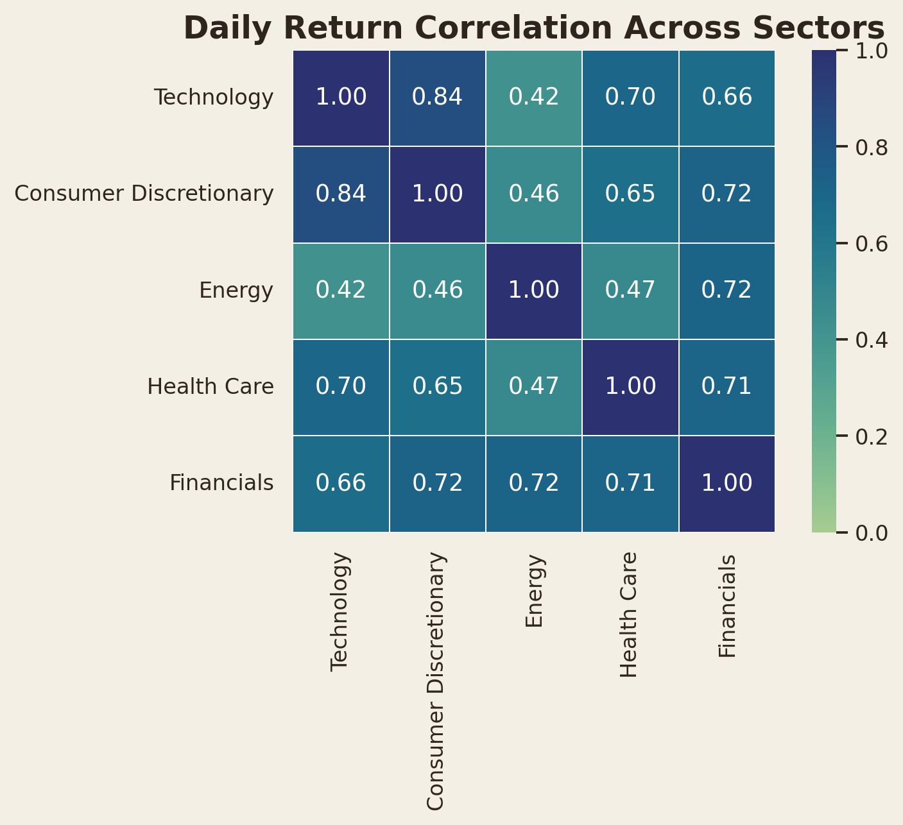
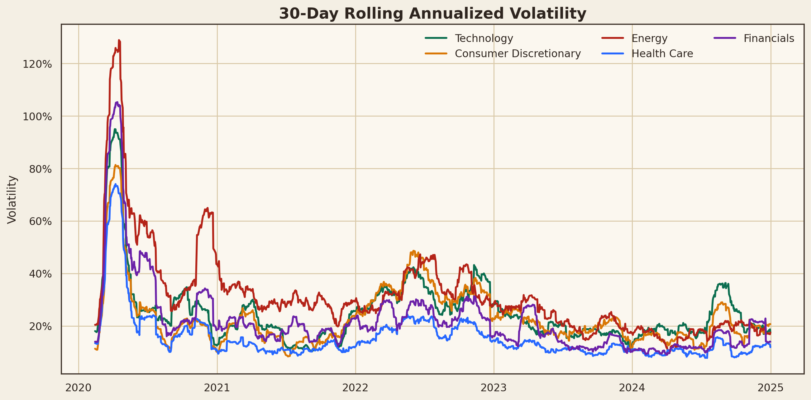
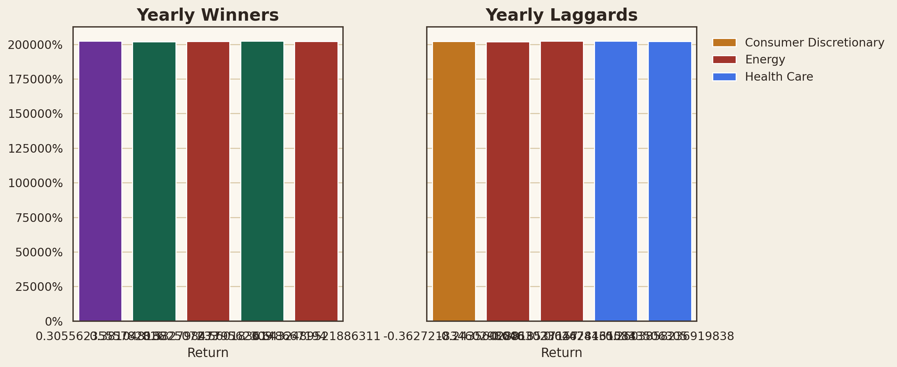

# 板块轮动分析 | Sector Rotation Analysis

Track 2 GitHub Data Analysis Project focused on whether major equity sectors rotate across different macro regimes.

**Demo Video (Mediasite):** 

## Snapshot

| Metric | Result |
|---|---|
| Best full-period sector | **Technology** (160.5% total return) |
| Weakest full-period sector | **Health Care** (45.9% total return) |
| 2022 defensive winner | **Energy** (64.3%) |
| 2023 rebound leader | **Technology** (56.0%) |

<p align="center">
  
  
</p>

## 1. Problem & User

This project asks whether sector performance follows a rotation pattern across the pandemic shock, the 2022 rate-hike cycle, and the 2023-2024 recovery. The target users are individual investors and finance/economics students who want a practical, visual way to understand cross-sector leadership.

## 2. Data

- Source: Yahoo Finance via the `yfinance` Python package
- Access date: 2026-04-21
- Analysis window: 2020-01-01 to 2024-12-31
- Frequency: daily prices, transformed into daily / monthly / quarterly returns

| ETF | Sector |
|---|---|
| `XLK` | Technology |
| `XLY` | Consumer Discretionary |
| `XLE` | Energy |
| `XLV` | Health Care |
| `XLF` | Financials |

Generated datasets are stored in `data/`, including daily prices, daily returns, monthly returns, annual returns, rolling volatility, correlation matrix, and yearly rankings.

## 3. Methods

- Download adjusted close prices for five representative US sector ETFs
- Clean missing values with forward fill and common-date alignment
- Compute daily returns with `pct_change()` and monthly returns with `resample('ME')`
- Compare cumulative returns across sectors
- Build annual and quarterly return heatmaps
- Measure cross-sector correlation
- Estimate 30-day rolling annualized volatility
- Rank the strongest and weakest sector each year

## 4. Key Findings

- In 2022, Energy was the only clear defensive winner, returning 64.3%, while Consumer Discretionary dropped 36.3%.
- The 2023 rebound was led by Technology, which gained 56.0% as growth assets recovered.
- Across the full 2020-2024 window, Technology delivered the highest total return at 160.5%, while Health Care lagged at 45.9%.
- The tightest daily co-movement came from Technology and Consumer Discretionary, with a correlation of 0.84, indicating strong cyclical overlap.
- Sector leadership changed materially between the pandemic shock, the 2022 hiking cycle, and the 2023-2024 recovery, which supports a rotation-based allocation lens.

## 5. Visual Preview

<p align="center">
  
  
</p>

<p align="center">
  
  
</p>

## 6. How to Run

### Conda environment

```bash
conda env create -f environment.yml
conda activate acc102_track2
python scripts/build_artifacts.py
python scripts/generate_notebook.py
jupyter nbconvert --to notebook --execute --inplace notebook.ipynb
```

### Optional Streamlit demo

```bash
streamlit run streamlit_app.py
```

## 7. Repository Structure

```text
.
|-- ACC102_Track2_ProjectPlan.md
|-- README.md
|-- notebook.ipynb
|-- reflection_report.md
|-- requirements.txt
|-- environment.yml
|-- streamlit_app.py
|-- data/
|-- figures/
|-- reports/
|-- scripts/
`-- src/
```